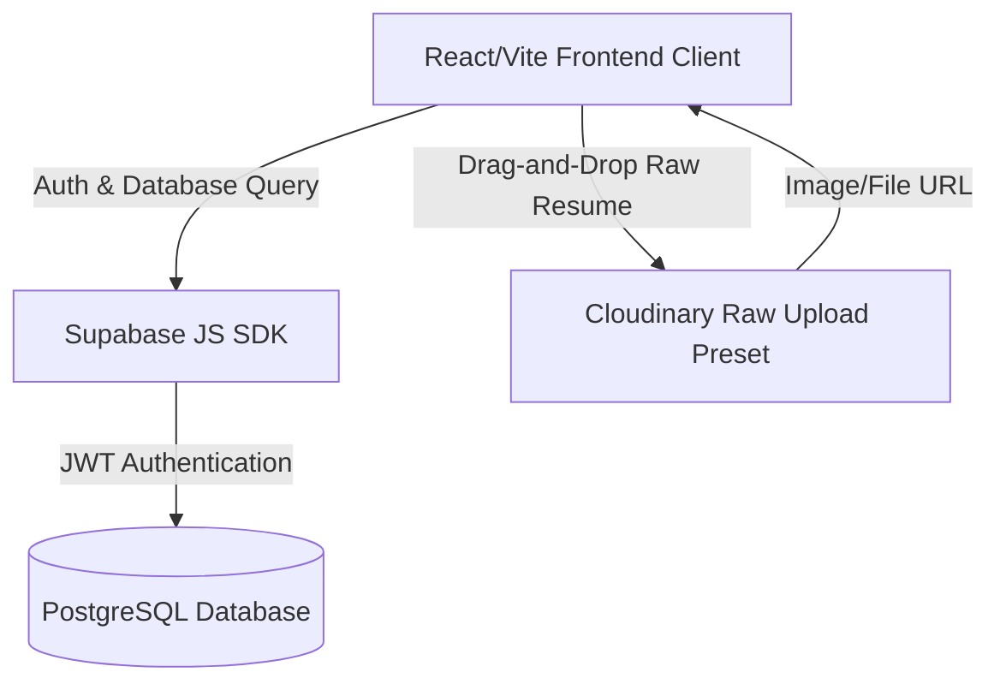

# Aura Portfolio: Architectural Documentation & Reference Manual

This document provides a detailed overview of the design system, system architecture, database transition, custom components, and deployment steps of the **Aura Portfolio** web application.

---

## 1. Executive Summary & Design Aesthetics

Aura Portfolio is an ultra-modern, glassmorphic developer portfolio tailored for cybersecurity engineers and software analysts. 

### Modern Visual Aesthetic
* **Color Palette:** Curated HSL/OKLCH dark-mode colors:
  * **Background:** Deep space slate (`#0B0F17` / `oklch(0.16 0.018 265)`)
  * **Surface/Cards:** Glassmorphism translucent surfaces with radial glow hover states.
  * **Accent Colorways:** Electric Neon Blue, Cyber Purple, and Vibrant Cyan.
* **Micro-Animations:** Fluid entry effects driven by Framer Motion, floating gradient background orbs, drifting particle layers, custom target cursor trails, and key-press spark effects.

---

## 2. Dynamic Feature Showcases

### A. Cybersecurity Interactive Chatbot Terminal
Floating at the bottom-left corner of the viewport, the bot shell connects visitors to your portfolio data.


* **Key features:**
  * **Handshake Sequences:** Boots up with a green/cyan CRT monitor scanline simulation.
  * **Typing Animation:** Queues and types out command results character-by-character for a conversational feel.
  * **Mini Robot Icon Avatars:** Prefix bot replies to distinguish them from visitor commands.
  * **Handshake Handlers:**
    * `help` - Lists CLI inputs.
    * `about` / `projects` - Outputs summaries of credentials.
    * `contact` - Triggers an interactive workflow prompting for Name, Email, and Message, and saves submissions to Supabase.
  * **Window Controls:**
    * **Minimize:** Slides down into the robot trigger button. Preserves active memory.
    * **Close (X):** Scales down and fades directly into the button, completely resetting the shell.
    * **Maximize:** Expands into a centered viewport modal.

### B. Interactive Skills Globe & Orbital Tracks
* **Skills Visualization:** Floating particles pulse and track along orbiting paths surrounding the profile photo in the Hero section.
* **Dismiss Helper:** The close button is removed in favor of a clean backdrop exit with keyboard support:
  `Click any node to explore — hover the globe to pause — press ESC to exit.`

### C. Cybersecurity Bootloader (Preloader)
* An incremental checklist that simulates firewall diagnostics, decryption progress from `0%` to `100%`, and displays green checkmarks (`[✓] OK`) before scaling away and blurring.

---

## 3. Database Transition: Firebase to Supabase + Cloudinary

To improve permission speeds and remove UUID parser bugs, the application was migrated from Firebase to **Supabase (PostgreSQL Database + Auth)** and **Cloudinary (Storage)**.

### System Architecture Schema



---

## 4. Supabase Schema Definition (PostgreSQL DDL)

To completely initialize the backend, execute these SQL statements in your Supabase SQL editor:

```sql
-- 1. Create Contacts Table
CREATE TABLE public.contacts (
    id UUID DEFAULT gen_random_uuid() PRIMARY KEY,
    name TEXT NOT NULL,
    email TEXT NOT NULL,
    message TEXT NOT NULL,
    created_at TIMESTAMP WITH TIME ZONE DEFAULT timezone('utc'::text, now()) NOT NULL
);

-- 2. Create Settings Table
CREATE TABLE public.settings (
    id UUID DEFAULT gen_random_uuid() PRIMARY KEY,
    name TEXT NOT NULL,
    title TEXT NOT NULL,
    roles TEXT[] NOT NULL,
    bio TEXT NOT NULL,
    avatar TEXT NOT NULL,
    email TEXT NOT NULL,
    github TEXT,
    linkedin TEXT,
    resume_url TEXT,
    show_resume BOOLEAN DEFAULT true,
    show_stats BOOLEAN DEFAULT true,
    stats JSONB DEFAULT '[]'::jsonb,
    visible_sections JSONB DEFAULT '{"about":true,"experience":true,"projects":true,"certifications":true,"contact":true}'::jsonb,
    created_at TIMESTAMP WITH TIME ZONE DEFAULT timezone('utc'::text, now()) NOT NULL
);

-- 3. Create Resumes Table
CREATE TABLE public.resumes (
    id UUID DEFAULT gen_random_uuid() PRIMARY KEY,
    name TEXT NOT NULL,
    file_url TEXT NOT NULL,
    file_type TEXT DEFAULT 'pdf',
    active BOOLEAN DEFAULT false,
    created_at TIMESTAMP WITH TIME ZONE DEFAULT timezone('utc'::text, now()) NOT NULL
);

-- 4. Enable Row Level Security (RLS)
ALTER TABLE public.contacts ENABLE ROW LEVEL SECURITY;
ALTER TABLE public.settings ENABLE ROW LEVEL SECURITY;
ALTER TABLE public.resumes ENABLE ROW LEVEL SECURITY;

-- Allow anonymous read access
CREATE POLICY "Allow public read access" ON public.settings FOR SELECT USING (true);
CREATE POLICY "Allow public read access" ON public.resumes FOR SELECT USING (true);
-- Allow public inserts for contacts (for the contact forms/terminal)
CREATE POLICY "Allow public insert contacts" ON public.contacts FOR INSERT WITH CHECK (true);

-- Allow authenticated admin write access
CREATE POLICY "Admin full write settings" ON public.settings FOR ALL USING (auth.role() = 'authenticated');
CREATE POLICY "Admin full write resumes" ON public.resumes FOR ALL USING (auth.role() = 'authenticated');
CREATE POLICY "Admin full read contacts" ON public.contacts FOR SELECT USING (auth.role() = 'authenticated');
```

---

## 5. Deployment Setup Guide

### 1. Clone & Install
```bash
git clone <your-repo>
cd aura-portfolio
npm install
```

### 2. Configure Environment Keys
Create a `.env.local` file in the root directory:
```env
VITE_SUPABASE_URL=https://<your-supabase-project-id>.supabase.co
VITE_SUPABASE_ANON_KEY=<your-supabase-anon-key>
VITE_CLOUDINARY_CLOUD_NAME=<your-cloudinary-cloud-name>
VITE_CLOUDINARY_UPLOAD_PRESET=<your-cloudinary-unsigned-upload-preset>
```

### 3. Run Dev Server
```bash
npm run dev
```

### 4. Build for Production
```bash
npm run build
```

---
*Documentation compiled on 2026-08-05. Aura Portfolio System v1.42.*
